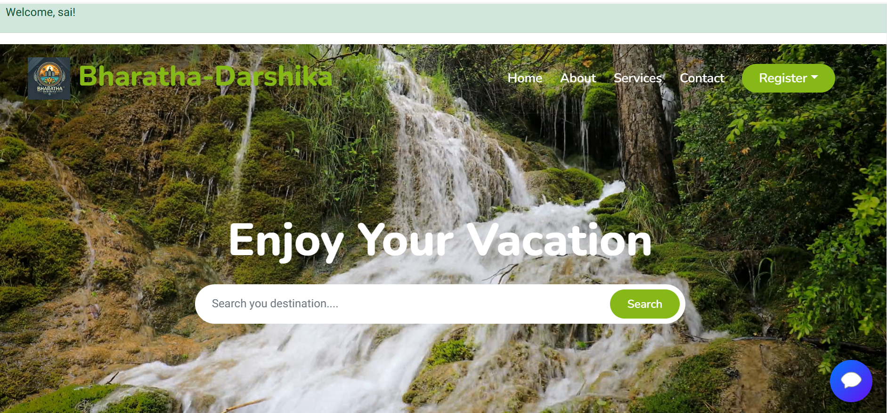

# 🇮🇳 Bharath Darshika

**Bharath Darshika** is a modern tourism web app to explore India's diverse and rich heritage.  
It provides a powerful interface for discovering tourist places by zones and states, including spiritual, adventurous, and natural destinations.

---

## ✨ Features

- 🧭 Zone-wise & State-wise Place Listings
- 🏖️ Categories: Temples, Beaches, Hills, Forests
- 🧑‍🔧 Skilled Workers (Guides, Drivers) based on Location
- 🧳 Travel Packages (High, Medium, Low Budget)
- 🤖 Smart Chatbot for User Help
- 🖼️ Upload Image to Detect Tourist Place (AI Feature)
- 🧑‍💼 Admin Dashboard (Add/Edit/Delete States & Places)
- 🌓 Dark Mode Toggle
- 📍 Google Maps Integration

---

## 🖼️ Screenshots

### 🏠 Home Page  

---

### 🧑‍💻 Admin Dashboard  

---

### 🗺️ State-wise Tourist View  

---

### 🤖 Chatbot Assistant  

---

## 🪪 License

Licensed under **MIT License** — use, share, and build with credit.

